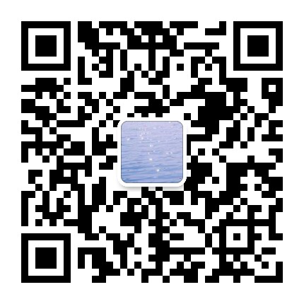
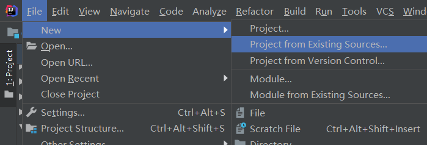
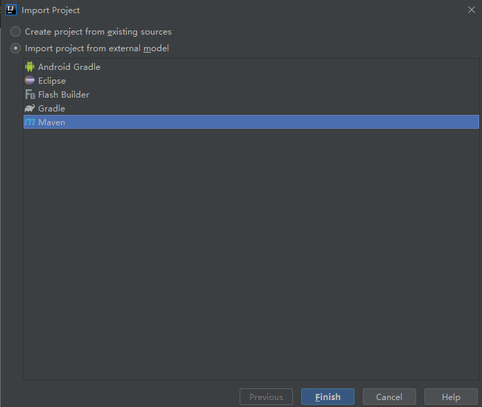
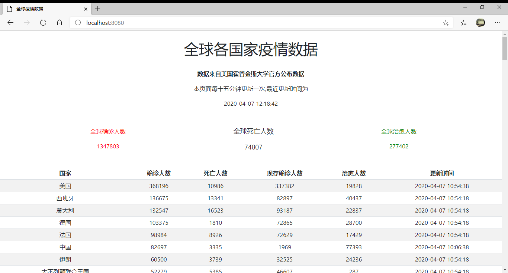

# 通过springboot实时获取新型冠状病毒全球数据并通过网页展示
本文涉及到的技术要点以及相关版本：
* springboot：2.2.6.RELEASE
* tomcat：8.0
* mysql：5.7
* 百度翻译开放API
* HTTP GET

基本思路：
基于springboot的定时功能，使用`HTTP GET`获取json格式疫情数据，
通过处理后调用`百度翻译API`将国家名称转化为中文，最后将获取到的数据通过Spring Data Jpa映射写入到mysql数据库中。

前端页面可通过访问数据库内容获取疫情数据。
## Attention
本人也是个springboot新手，项目中难免有些问题，欢迎大家指正，有兴趣的可以加一下我的微信，一起交流学习：


## Guides
（1）首先，在本地安装mysql服务，linux平台或者windows平台搭建方法不同，详情可百度，基本都有完整方法。

&emsp; mysql安装好之后，设置账号密码：假定你的账号密码为：user：root； password：vadmin123@VADMIN

&emsp; 在这边要注意一点，要在数据库中保存中文，要进行一些设置：详情可参考：
https://www.cnblogs.com/BHfeimao/p/6496574.html

&emsp;进入到mysql中，创建一个spring-guides数据库。

（2）申请百度翻译开发者账号：https://api.fanyi.baidu.com/，申请百度通用翻译API，可以获取到APP ID和密钥。
用于将国家名称翻译为中文。

（3）将本项目下载下来之后，解压到某个位置，将本项目导入IDEA，具体为：

&emsp; 导入方法：

&emsp; File -> New -> Project From Existing Resources -> get-covid19-global-data-v2 -> Import As Maven

示例：




（4）项目导入IDEA之后，修改以下文件：

&emsp; src/main/resources/application.properties文件中，将username和password设置为你的mysql数据库账号密码
```properties
spring.datasource.driver-class-name=com.mysql.cj.jdbc.Driver
spring.datasource.url=jdbc:mysql://localhost:3306/spring-guides?characterEncoding=utf8&useSSL=false&serverTimezone=UTC
spring.datasource.username=root
spring.datasource.password=vadmin123@VADMIN
spring.jpa.show-sql=true
spring.jpa.hibernate.ddl-auto=none
spring.jackson.serialization.indent_output=true
```
&emsp;  src/main/java/com/weilian/covid19/scheduler/SchedulerTasks.java文件中的第44、45行，
修改如下内容为你申请的百度翻译API的app id和密钥：
```java
        String APP_ID = "";
        String SECURITY_KEY = "";
```
（5）修改完之后，运行`Covid19Application.java`，即可在控制台看到输出：

&emsp; 本地浏览器访问： `http://localhost:8080`，可看到：

